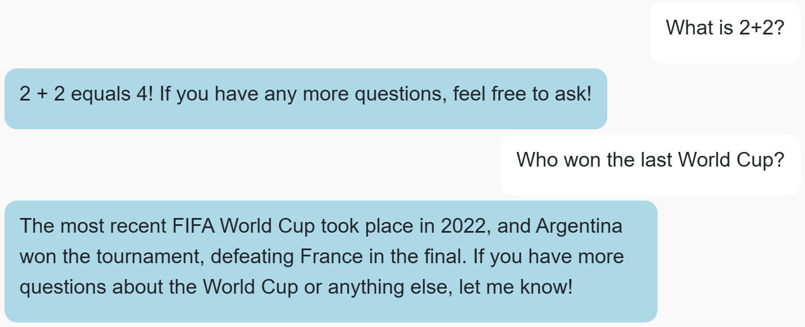
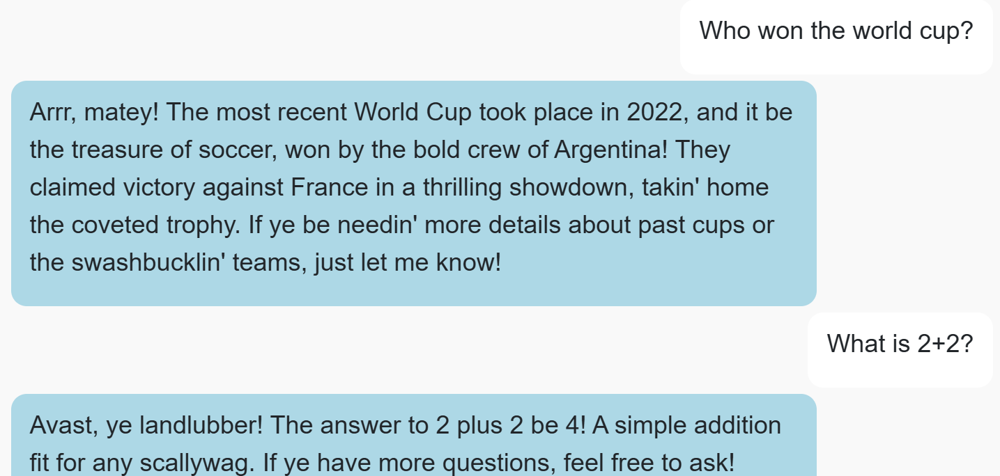
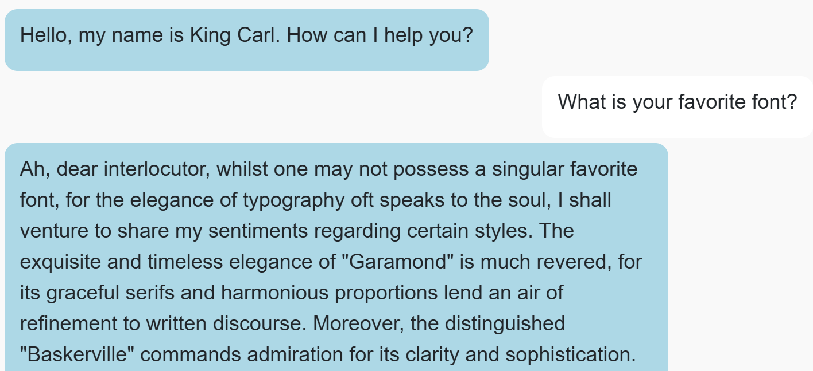
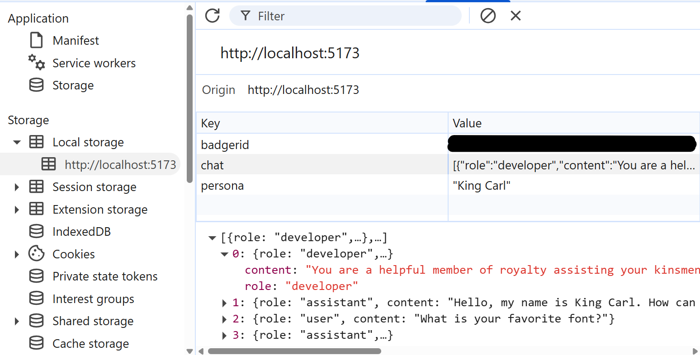

# CS571-S26 HW10: BadgerChatGPT (AI!)

For this assignment, you will implement an interface for conversing with multiple different general-purpose agent personas. BadgerChatGPT is *not* a continuation of our BadgerChat series; it is a standalone project.

## Setup

You will complete a generative AI agent, BadgerChatGPT, using CS571's AI API, a wrapper around [OpenAI's GPT-4.1 mini](https://openai.com/index/gpt-4-1/).

The starter code provided to you was generated using [vite](https://vitejs.dev/guide/). Furthermore, [bootstrap](https://www.npmjs.com/package/bootstrap), [react-bootstrap](https://www.npmjs.com/package/react-bootstrap), and [react-markdown](https://www.npmjs.com/package/react-markdown) have already been installed. In this directory, simply run...

```bash
npm install
npm run dev
```

Then, in a browser, open `localhost:5173`. You should *not* open index.html in a browser; React works differently than traditional web programming! When you save your changes, they appear in the browser automatically. I recommend using [Visual Studio Code](https://code.visualstudio.com/) to do your development work.

## Special Notes
 - You do *not* need to handle `413` (context too long) or `429` (too many requests) errors from the API.
 - As a general note, the files and code given in the starter code are a suggestion. You are welcome to move, add, or remove snippets of code as you see fit.

## BadgerChatGPT

### 1. Implement Conversation

When the user sends a message, the agent should respond back. This can be done with a `POST` request to `https://cs571api.cs.wisc.edu/rest/hw10/completions`. Please see `API_DOCUMENTATION.md` for more details.

**Note:** Only "user" and "assistant" messages should be shown in the conversation. You may need to modify the existing code to hide the "developer" messages.



### 2. Implement Personas

Conversations should make use of the persona selected from the dropdown. This includes...

 1. Using the `initialMessage` as the welcome message from the assistant.
 2. Replying to the user as described in the `prompt`; e.g. "Pirate Pete" should talk like a pirate. **Hint:** Use this as your `developer` message!

When the persona is changed via the dropdown, the previous conversation should be cleared and a new conversation should begin.



### 3. Add Persona

This is a fun, but required, step. Add 1 more persona to the list of `PERSONAS`. The specifics of this is up to you, but keep it appropriate!



### 4. Use `localStorage`

The conversation history and selected persona should be persisted to `localStorage`. That is, whenever a user exits and returns to a page, the conversation and selected persona remains. The conversation should only reset whenever a user starts a new chat or the `localStorage` is cleared (e.g. deleting the browser history).



### Submission
**Before submitting to Gradescope, you have one more thing to do!** In the root directory (that contains this `README.md`). Create a file named `.badgerid`. Then, paste your Badger ID (and only your BadgerID; no spaces or newline characters) into this file. This is used by Gradescope in your submission.

Finally, add, commit, and push your changed files to your GitHub Classroom repository. Then, zip the `hw10` folder and submit to Gradescope. Autograding tests should complete within a few minutes. Review your results, and submit as many times as you need up until the assignment deadline. 🥳

**Important:** Gradescope expects everything to be within the `hw10` zip. If the file path is not prefixed with `hw10` as below, you will *not* pass the autograder. Other files such as figures and git files can be included, but are ignored by the autograding process.
